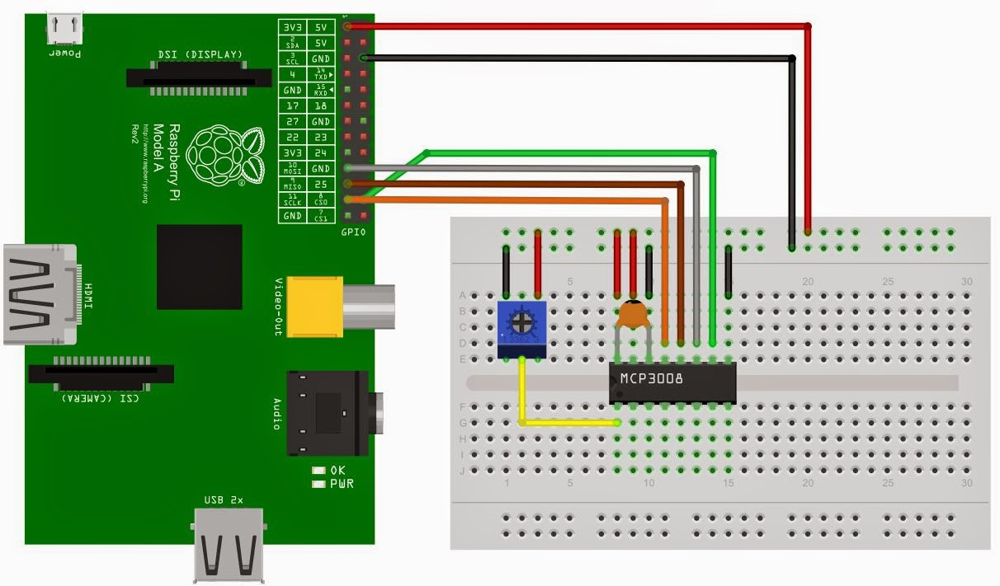
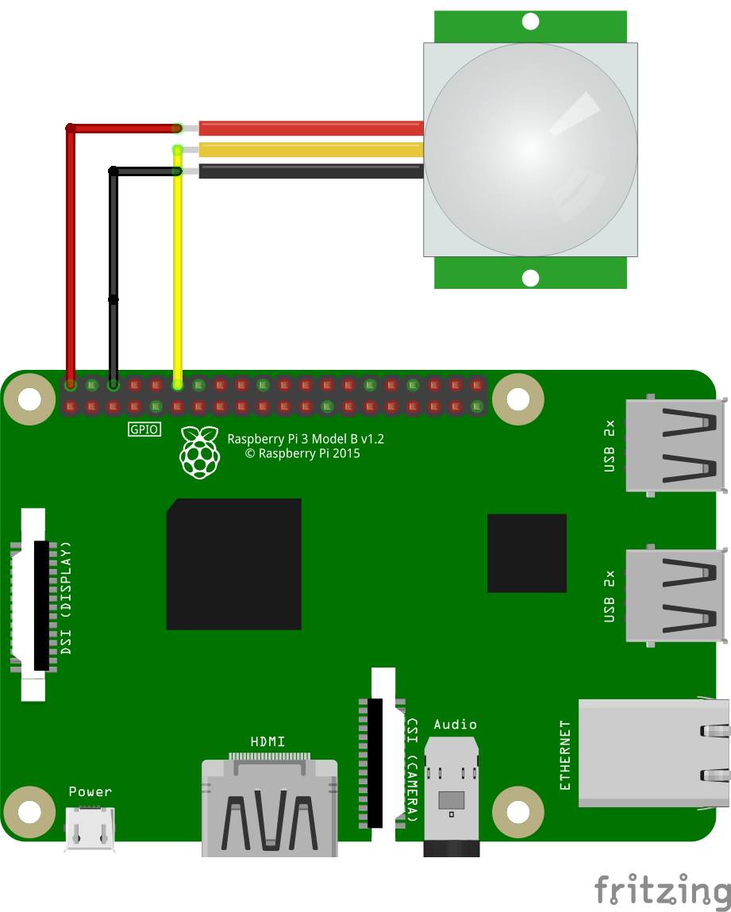

# GPIO SHADER OpenFL Raspberry Pi

This is a test of using the gpio ports in OpenFL on the Raspberry Pi 3.
It's a slideshow that uses a simple shader for transitioning between images.
A Pir Sensor (connected to gpio 18) controls when to transition to the next slide.
A Potentiometer connected to the Raspberry Pi via an mcp3008 ( on analog 0) 
is controlling a uniform in the shader.
This uniform desaturates the colors from the to textures.

If you need to know how to wire the mcp3008 and the Potentiometer to the Raspberry Pi
have a look at the following diagram or google for "raspberry pi mcp3008 potentiometer"

Here's the way to connect the PIR to GPIO18  

Keyboard Shortcuts:
- 0 -> toggle calibration of analog0
- H -> hide debugfield
- D -> debug file list to commandline
- F -> toggle between contentFill modes
- S -> toggle Show FileName
- SPACE -> restart at first image
- W -> toggle FPS debug

This project uses my 'quick and dirty' hxPiGpio haxe extension.
[https://github.com/gepatto/hxPiGpio](https://github.com/gepatto/hxPiGpio)

## This project requires lime 6.4.0 and OpenFl develop branch
