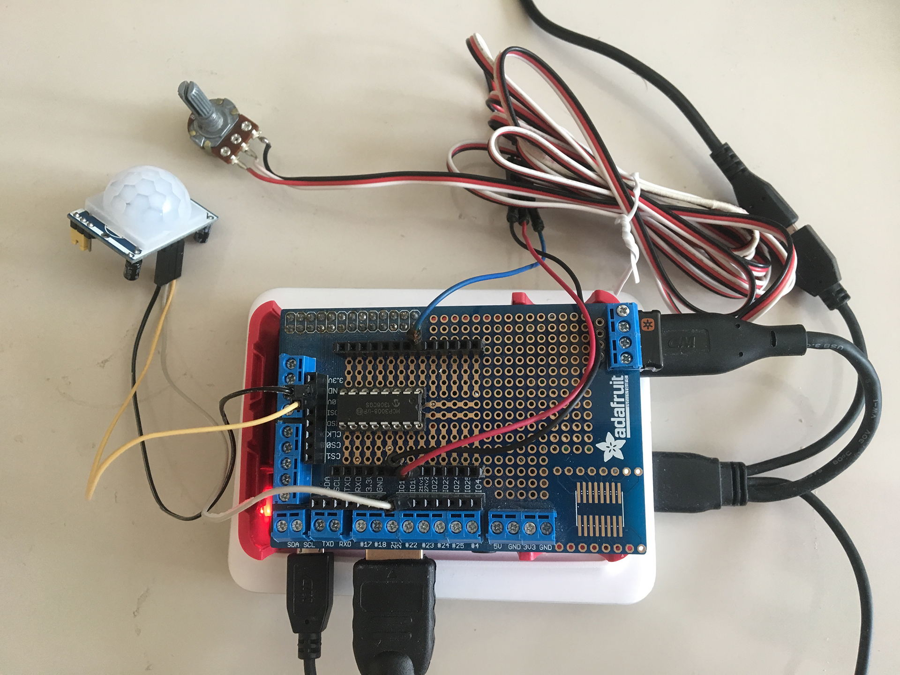

# GPIO SHADER OpenFL Raspberry Pi

This is a test of using the gpio ports in OpenFL on the Raspberry Pi 3.
It's a slideshow that uses a simple shader for transitioning between images.
A Pir Sensor (connected to gpio 18) controls when to transition to the next slide.
A Potentiometer connected to the Raspberry Pi via an mcp3008 ( on analog 0) 
is controlling a uniform in the shader.
This uniform desaturates the colors from the to textures.

This project uses my 'quick and dirty' hxPiGpio haxe extension.
[https://github.com/gepatto/hxPiGpio]()

## This project requires lime 6.4.0 and OpenFl develop branch
